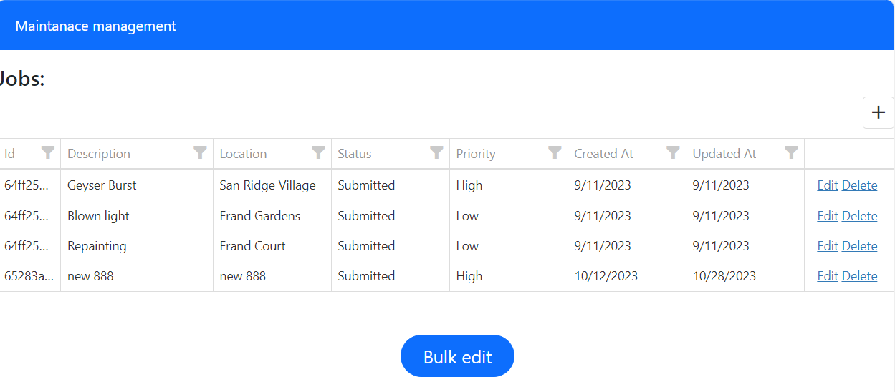
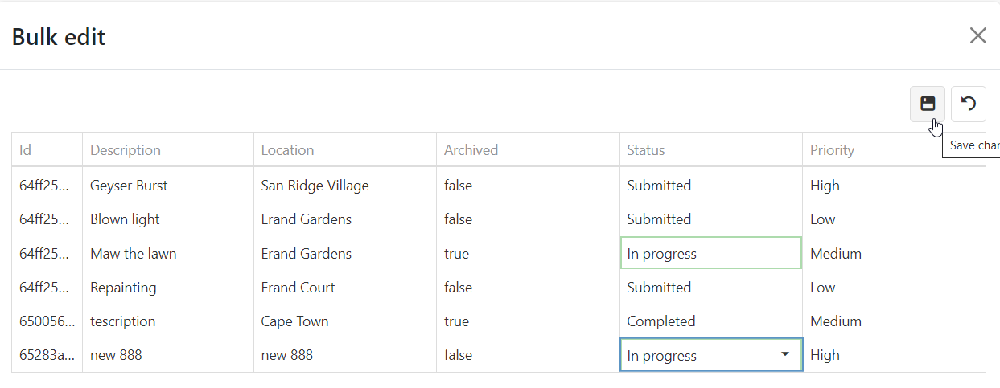

<!-- Improved compatibility of back to top link: See: https://github.com/othneildrew/Best-README-Template/pull/73 -->
<a name="readme-top"></a>


[![Contributors][contributors-shield]][contributors-url]
[![Forks][forks-shield]][forks-url]
[![Stargazers][stars-shield]][stars-url]
[![Issues][issues-shield]][issues-url]
[![MIT License][license-shield]][license-url]
[![LinkedIn][linkedin-shield]][linkedin-url]


<!-- PROJECT LOGO -->
<br />
<div align="center">
  <a href="https://github.com/KaraboMolemane/maintenance-management">
    
  </a>

<h3 align="center">Maintance management</h3>
  <p align="center">
    This is a React app (frontend) that uses Express and Mongoose (backend) to manage jobs in a maintenance company. A user is able to submit a job with all the relevant details. Each job should have a status, being one of submitted, in progress, and completed. This project is a school project. 
    <br />
    <a href="https://github.com/KaraboMolemane/maintenance-management"><strong>Explore the docs »</strong></a>
    <br />
    <br />
    <a href="https://github.com/KaraboMolemane/maintenance-management">View Demo</a>
    ·
    <a href="https://github.com/KaraboMolemane/maintenance-management/issues">Report Bug</a>
    ·
    <a href="https://github.com/KaraboMolemane/maintenance-management/issues">Request Feature</a>
  </p>
</div>


<!-- TABLE OF CONTENTS -->
<details>
  <summary>Table of Contents</summary>
  <ol>
    <li>
      <a href="#about-the-project">About The Project</a>
      <ul>
        <li><a href="#built-with">Built With</a></li>
      </ul>
    </li>
    <li>
      <a href="#getting-started">Getting Started</a>
      <ul>
        <li><a href="#prerequisites">Prerequisites</a></li>
        <li><a href="#installation">Installation</a></li>
      </ul>
    </li>
    <li><a href="#usage">Usage</a></li>
    <li><a href="#roadmap">Roadmap</a></li>
    <li><a href="#contributing">Contributing</a></li>
    <li><a href="#license">License</a></li>
    <li><a href="#contact">Contact</a></li>
    <li><a href="#acknowledgments">Acknowledgments</a></li>
  </ol>
</details>


<!-- ABOUT THE PROJECT -->
## About The Project

<p align="right">(<a href="#readme-top">back to top</a>)</p>

### Built With

* [![React][React.js]][React-url]
* [![Expressjs][expressjs.com]][Express-url]
* [![Bootstrap][Bootstrap.com]][Bootstrap-url]
* [![DevExpress][js.devexpress.com]][devexpress-url]

<p align="right">(<a href="#readme-top">back to top</a>)</p>


<!-- GETTING STARTED -->
## Getting Started


### Prerequisites

Below is a list of things you need to use the project and how to install them.
* MongoDB
  * To use this project you will need a MongoDB database. 
  *  If you do not have a MongoDB account already, create a new one [here](https://www.mongodb.com/)
  * In the root folder, create a `.env` file and add your connection string as follows: 

      ```
      MONGODB_URI="your-mongodb-uri-here"
      ```
  * NB!!! Remember not to never publish your connection string to GitHub. With that said, always ensure that the `.env` file is included in the `.gitignore` file.


### Installation

* Clone the repo
   ```sh
   git clone https://github.com/KaraboMolemane/maintenance-management.git
   ```
* Run Back end
  * Open the project in a terminal and install NPM packages
    ```sh
    npm install
    ```
  * Once the installtion is done, you can start the backend by typing the following:
    ```sh
    npm start
    ```
  * The back end runs on http://localhost:8080/
  * The project uses [nodemon](https://www.npmjs.com/package/nodemon) to automatically reload every time a change is made and saved.

* Run Front end
  * Open another instance of the terminal on your project and navigate to the front end by typing
    ```sh
     cd frontend
    ```
  * Install NPM packages for the front end
    ```sh
     npm install
    ```
  * Once the installtion is done, you can start the frontend by typing the following:
    ```sh
    npm start
    ```
  * The front end runs on http://localhost:3000/ and will automatically open on your default browser. if this does not happen, simply open http://localhost:3000/ on your preffered browser.
  * The project uses [nodemon](https://www.npmjs.com/package/nodemon) to automatically reload every time a change is made and saved.

<p align="right">(<a href="#readme-top">back to top</a>)</p>


<!-- USAGE EXAMPLES -->
## Usage

Once the project is opened in your browser. You will be presented with the home screen with pexisting jobs (if they exist). On this screen you will be able to view, add, edit, and delete individual jobs. 

<div align="center">
    
</div>

Bulk edit allows the user to perfrom bulk operstions on the jobs. 

<div align="center">
    
</div>

_For more examples, please refer to the [Documentation](https://example.com)_

<p align="right">(<a href="#readme-top">back to top</a>)</p>

<!-- ROADMAP -->
## Roadmap

- FR example here

See the [open issues](https://github.com/KaraboMolemane/maintenance-management/issues) for a full list of proposed features (and known issues).

<p align="right">(<a href="#readme-top">back to top</a>)</p>

<!-- CONTRIBUTING -->
## Contributing

Contributions are what make the open source community such an amazing place to learn, inspire, and create. Any contributions you make are **greatly appreciated**.

If you have a suggestion that would make this better, please fork the repo and create a pull request. You can also simply open an issue with the tag "enhancement".
Don't forget to give the project a star! Thanks again!

1. Fork the Project
2. Create your Feature Branch (`git checkout -b feature/AmazingFeature`)
3. Commit your Changes (`git commit -m 'Add some AmazingFeature'`)
4. Push to the Branch (`git push origin feature/AmazingFeature`)
5. Open a Pull Request

<p align="right">(<a href="#readme-top">back to top</a>)</p>


<!-- LICENSE -->
## License

N/A

<p align="right">(<a href="#readme-top">back to top</a>)</p>


<!-- CONTACT -->
## Contact

Karabo Molemane - https://www.linkedin.com/in/karabo-molemane/

Project Link: [https://github.com/KaraboMolemane/maintenance-management](https://github.com/KaraboMolemane/maintenance-management)

<p align="right">(<a href="#readme-top">back to top</a>)</p>


<!-- ACKNOWLEDGMENTS -->
## Acknowledgments

* [Othneil Drew](https://github.com/othneildrew/Best-README-Template)


<p align="right">(<a href="#readme-top">back to top</a>)</p>


<!-- MARKDOWN LINKS & IMAGES -->
<!-- https://www.markdownguide.org/basic-syntax/#reference-style-links -->
[contributors-shield]: https://img.shields.io/github/contributors/KaraboMolemane/authentication-manager.svg?style=for-the-badge
[contributors-url]: https://github.com/KaraboMolemane/maintenance-management/graphs/contributors
[forks-shield]: https://img.shields.io/github/forks/KaraboMolemane/authentication-manager.svg?style=for-the-badge
[forks-url]: https://github.com/KaraboMolemane/maintenance-management/network/members
[stars-shield]: https://img.shields.io/github/stars/KaraboMolemane/authentication-manager.svg?style=for-the-badge
[stars-url]: https://github.com/KaraboMolemane/maintenance-management/stargazers
[issues-shield]: https://img.shields.io/github/issues/KaraboMolemane/authentication-manager.svg?style=for-the-badge
[issues-url]: https://github.com/KaraboMolemane/maintenance-management/issues
[license-shield]: https://img.shields.io/github/license/KaraboMolemane/authentication-manager.svg?style=for-the-badge
[license-url]: https://github.com/KaraboMolemane/maintenance-management/blob/master/LICENSE.txt
[linkedin-shield]: https://img.shields.io/badge/-LinkedIn-black.svg?style=for-the-badge&logo=linkedin&colorB=555
[linkedin-url]: https://www.linkedin.com/in/karabo-molemane/
[product-screenshot]: images/screenshot.png
[Next.js]: https://img.shields.io/badge/next.js-000000?style=for-the-badge&logo=nextdotjs&logoColor=white
[Next-url]: https://nextjs.org/
[React.js]: https://img.shields.io/badge/React-20232A?style=for-the-badge&logo=react&logoColor=61DAFB
[React-url]: https://reactjs.org/
[Vue.js]: https://img.shields.io/badge/Vue.js-35495E?style=for-the-badge&logo=vuedotjs&logoColor=4FC08D
[Vue-url]: https://vuejs.org/
[Angular.io]: https://img.shields.io/badge/Angular-DD0031?style=for-the-badge&logo=angular&logoColor=white
[Angular-url]: https://angular.io/
[Svelte.dev]: https://img.shields.io/badge/Svelte-4A4A55?style=for-the-badge&logo=svelte&logoColor=FF3E00
[Svelte-url]: https://svelte.dev/
[Laravel.com]: https://img.shields.io/badge/Laravel-FF2D20?style=for-the-badge&logo=laravel&logoColor=white
[Laravel-url]: https://laravel.com
[Bootstrap.com]: https://img.shields.io/badge/Bootstrap-563D7C?style=for-the-badge&logo=bootstrap&logoColor=white
[Bootstrap-url]: https://getbootstrap.com
[JQuery.com]: https://img.shields.io/badge/jQuery-0769AD?style=for-the-badge&logo=jquery&logoColor=white
[JQuery-url]: https://jquery.com 
[expressjs.com]: https://img.shields.io/badge/Express-999D7C?style=for-the-badge&logo=express&logoColor=white
[Express-url]: https://expressjs.com
[js.devexpress.com]: https://img.shields.io/badge/DevExpress-1999AD?style=for-the-badge&logo=devexpress&logoColor=white
[devexpress-url]: https://js.devexpress.com
